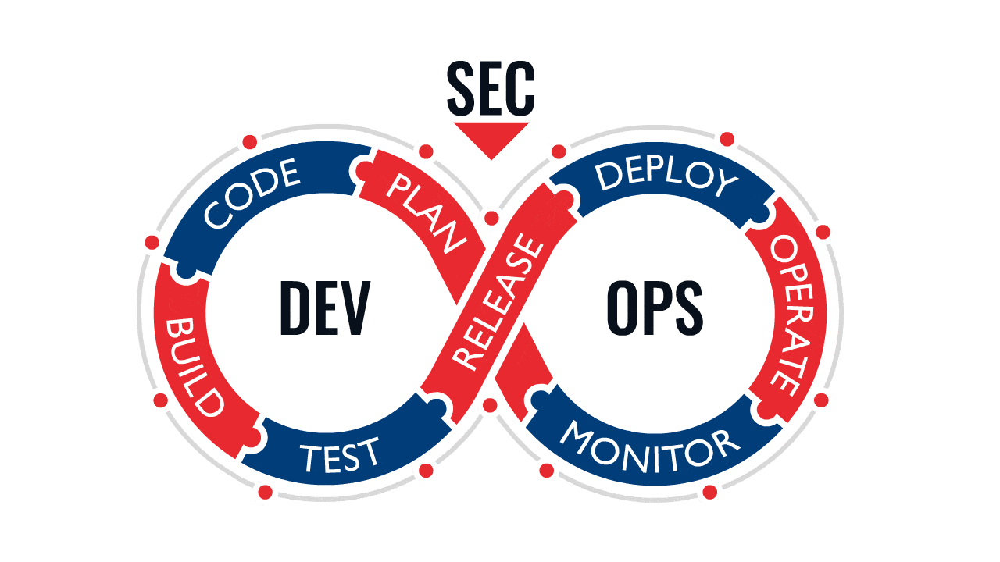

# Day 1: Introduction to DevOps

## Objectives
- Understand the basics of DevOps
- Learn about the DevOps lifecycle and key concepts
- Recognize the benefits of DevOps
- Get an overview of DevOps tools

## Concepts

### What is DevOps?

 DevOps is a set of practices that combines software development (Dev) and IT operations (Ops). It aims to shorten the systems development life cycle and provide continuous delivery with high software quality. DevOps is complementary with Agile software development; several DevOps aspects came from the Agile methodology.

### Key Principles of DevOps:

- Collaboration and Communication: Breaking down silos between development and operations teams.
- Automation: Automating repetitive tasks to improve efficiency and consistency.
- Continuous Integration and Continuous Deployment (CI/CD): Frequent code integration and automated deployment processes.
- Monitoring and Logging: Continuous monitoring of systems and applications for proactive issue resolution.

### DevOps Lifecycle

The DevOps lifecycle is an iterative process of continuous improvement and delivery. It typically includes the following phases:

**Plan**: Project planning, defining requirements and objectives.

**Code**: Writing and reviewing code, using version control systems.

**Build**: Compiling code, running tests, and generating build artifacts.

**Test**: Automated and manual testing to ensure code quality.

**Release**: Preparing for deployment, managing versioning and releases.

**Deploy**: Deploying applications to production environments.

**Operate**: Managing and monitoring applications in production.

**Monitor**: Continuous monitoring, logging, and feedback for improvements.

### Benefits of DevOps

Adopting DevOps practices offers several significant benefits:

**Faster Time to Market:** Accelerates the development and deployment process.

**Improved Collaboration:** Enhances communication and collaboration between teams.

**Increased Efficiency:** Automates repetitive tasks and processes.

**Better Quality:** Continuous testing and monitoring improve software quality.

**Greater Reliability:** Continuous monitoring and quick issue resolution increase system reliability.

**Scalability:** Allows organizations to scale infrastructure and applications more efficiently.

### DevOps Tools Overview

A variety of tools support DevOps practices, each catering to different phases of the lifecycle:

**Version Control:** Git, GitHub, GitLab, Bitbucket

**Continuous Integration and Continuous Deployment (CI/CD):** Jenkins, Travis CI, CircleCI, GitHub Actions

**Configuration Management:** Ansible, Puppet, Chef, SaltStack

**Containerization:** Docker, Podman

**Container Orchestration:** Kubernetes, OpenShift

**Infrastructure as Code (IaC):** Terraform, CloudFormation

**Monitoring and Logging:** Prometheus, Grafana, ELK Stack (Elasticsearch, Logstash, Kibana), Splunk

**Collaboration and ChatOps:** Slack, Microsoft Teams, Mattermost

### Example Tools in Action:

**GitHub:** Version control and collaboration.

**Jenkins:** Automating CI/CD pipelines.

**Ansible:** Configuration management and automation.

**Docker:** Containerizing applications for consistent environments.

**Kubernetes:** Orchestrating and managing containerized applications.

## Summary

In this lesson, you learned about the basics of DevOps, including its principles, lifecycle, benefits, and tools. DevOps emphasizes collaboration, automation, and continuous improvement to enhance software development and operations processes.
